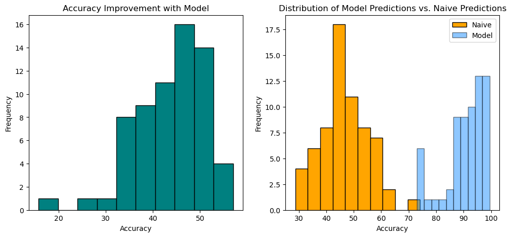

# MLB Pitch Prediction

This project aims to predict the next pitch type in a baseball game based on prior pitches. The analysis leverages pitch-by-pitch data to build predictive models, providing insights into pitching tendencies and strategies.

## Table of Contents

1. [Project Overview](#project-overview)
2. [Data](#data)
3. [Notebooks](#notebooks)
4. [Results](#results)
5. [Future Work](#future-work)

---

## Project Overview

The goal of this project is to develop machine learning models that can predict the next pitch type thrown by a pitcher in Major League Baseball (MLB) games. This project explores exploratory data analysis (EDA), data preprocessing, and modeling to build predictive insights.

---

## Data

The dataset contains pitch-by-pitch information from MLB games, including features such as:

- **Pitcher ID**: Unique identifier for the pitcher.
- **Pitch Type**: The type of pitch thrown (e.g., fastball, curveball).
- **Game Context**: Includes details like the count, inning, and prior pitches.

The data is cleaned and processed before modeling to handle missing values, encode categorical variables, and balance pitch types for robust model training.

---

## Notebooks

### 1. `eda.ipynb` and `eda2.ipynb`

These notebooks perform an exploratory analysis of the dataset, uncovering patterns and relationships such as:
- Distribution of pitch types.
- Pitcher tendencies in different game contexts.
- Visualization of trends and anomalies in the data.

### 2. `data_preprocessing.ipynb`

This notebook prepares the data for modeling by:
- Cleaning and formatting raw data.
- Handling missing or imbalanced data.
- Encoding categorical variables into numerical formats.

### 3. `modeling.ipynb`

The modeling notebook trains and evaluates machine learning models, including:
- **XGBoost** models for pitcher-specific predictions.
- Evaluation of model performance using accuracy and confusion matrices.
- Comparison of predictive accuracy against baseline models (e.g., predicting the most common pitch type).

---

## Results

- **Model Accuracy**: The trained models demonstrate improvements over naive predictions, with detailed results provided in the modeling notebook.
- **Pitcher Insights**: Individual pitcher tendencies and predictive accuracy are explored, highlighting the variability in prediction performance across pitchers.



---

## How to Run

1. Clone this repository:
   ```bash
   git clone https://github.com/your-repo/baseball-pitch-prediction.git
   cd baseball-pitch-prediction